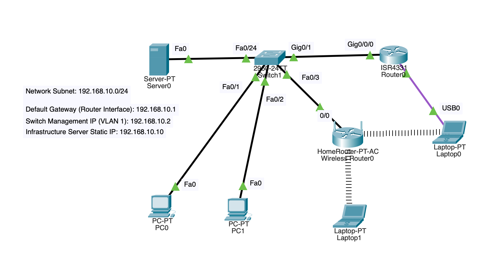

# Secure SOHO/Branch Office Network Deployment

## 🌐 Project Overview
This repository contains the full architectural design and implementation files for a secure, simulated enterprise branch office network. The network isolates wireless user segments from the corporate core utilizing localized DHCP infrastructure, device hardening baselines, and stateful NAT translation boundaries.

## 📊 Logical IP Addressing Matrix
| Device / Zone | Interface | Assigned IP | Subnet Mask | Default Gateway | Purpose |
| :--- | :--- | :--- | :--- | :--- | :--- |
| **COLOMBO-EDGE-RTR** | Gig0/0/0 | 192.168.10.1 | 255.255.255.0 | N/A | Edge Gateway |
| **COLOMBO-CORE-SW** | VLAN 1 | 192.168.10.2 | 255.255.255.0 | 192.168.10.1 | Management Interface |
| **Core Infrastructure** | Server0 | 192.168.10.10 | 255.255.255.0 | 192.168.10.1 | Static DHCP/DNS Host |
| **Wired Endpoints** | PC0 / PC1 | Dynamic (Pool) | 255.255.255.0 | 192.168.10.1 | Corporate Seats (.20+) |
| **Wireless Zone** | Laptops | Dynamic (NAT) | 255.255.255.0 | 192.168.0.1 | Isolated Wi-Fi Space (.100+) |

## 🔒 Implemented Security & Hardening Baselines
The following enterprise staging protocols were deployed via the Cisco IOS CLI to secure the internal management plane:
* **Privileged Mode Security:** Configured secure hashing algorithms via `enable secret` to protect global configuration access modes.
* **Console Line Abstraction:** Disabled automated domain name resolutions using `no ip domain-lookup` to avoid CLI lockouts during maintenance windows.
* **Credential Protection:** Activated `service password-encryption` to scramble plain-text configuration strings within device memory.
* **Access Compliance:** Deployed official Message of the Day (`banner motd`) banners to comply with enterprise access standards.

## 🧪 Verification Logs & Operational Evidence

### 1. Gateway Status Matrix (`show ip interface brief`)
Interface              IP-Address      OK? Method Status                Protocol 
GigabitEthernet0/0/0   192.168.10.1    YES manual up                    up 
GigabitEthernet0/0/1   unassigned      YES unset  administratively down down 
GigabitEthernet0/0/2   unassigned      YES unset  administratively down down 
Vlan1                  unassigned      YES unset  administratively down down
